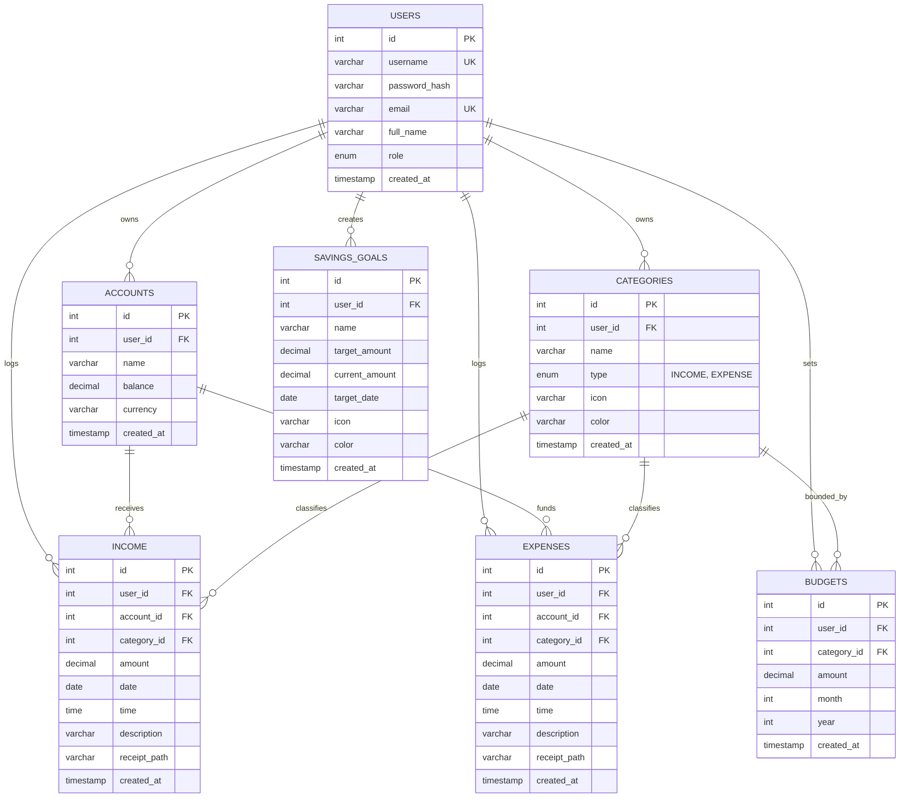

# Database Schema Diagram

This document illustrates the Entity-Relationship (ER) model for the MySQL database underpinning Expense Tracker Pro.

## Indexes and Constraints
- **Foreign Keys**: All foreign keys utilize `ON DELETE CASCADE` to ensure orphaned records (e.g., expenses belonging to a deleted user) are automatically pruned, maintaining referential integrity.
- **Unique Constraints**: Usernames and Emails are strictly unique to prevent authentication conflicts.
